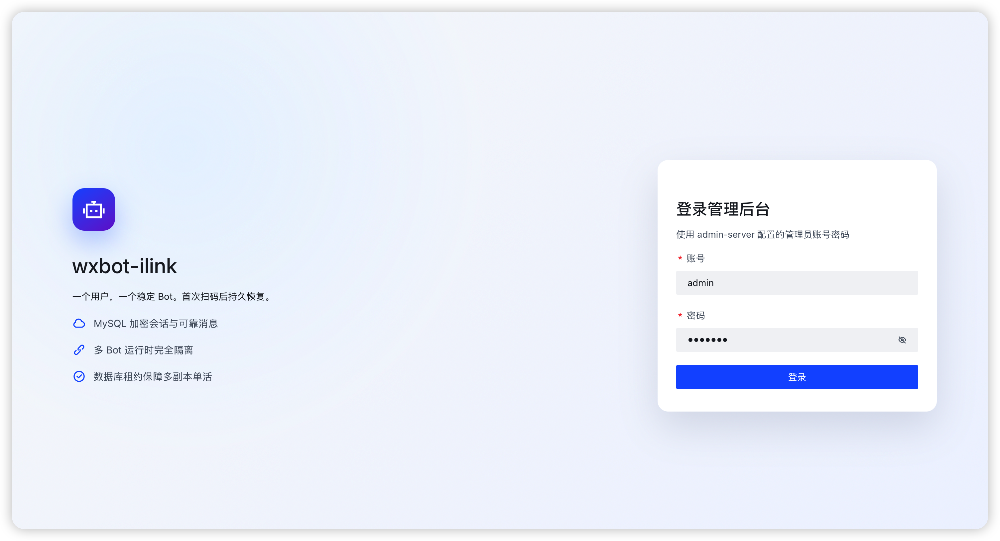
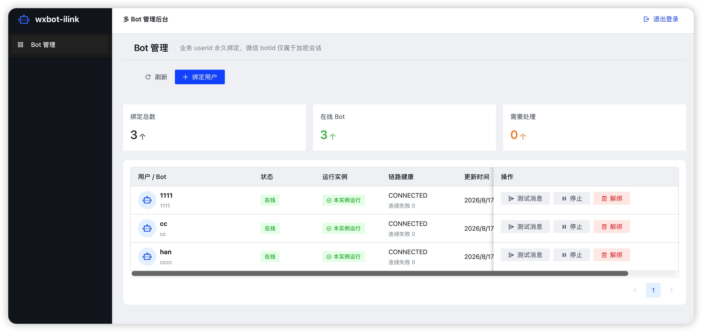

# wxbot-ilink

## 企业 AI 连接微信的中间层

`wxbot-ilink` 是一个基于 Java 17 的非官方微信 iLink Bot SDK，也是一个面向企业 AI 场景的连接层。

它负责把微信里的员工、客户和业务对话，稳定地连接到企业自己的 AI 助手、企业内容 Agent 和业务系统。项目关注长期运行、会话恢复、消息可靠投递、多 Bot 管理和企业级安全边界，让团队可以把 Agent 放进日常沟通里，并持续管理它们的身份、权限、状态和责任范围。

> 本项目与腾讯、微信不存在隶属、授权或背书关系。微信及相关标识归其权利人所有。使用前请自行确认协议、账号和业务合规风险。

## 我们想解决什么问题

企业已经拥有知识库、业务系统和各种 AI Agent，员工也开始使用 AI 处理问答、检索、写作、客服和流程协同。真正难落地的地方，常常发生在连接环节。

- 员工需要在熟悉的微信里找到企业 AI 助手。
- 企业需要让不同 Agent 使用正确的知识、身份和权限。
- 管理者需要知道谁在使用哪个 Agent，Agent 正在处理什么，以及异常时怎样停用。
- 开发团队需要处理微信会话、消息游标、重试、去重、媒体和多实例运行，而不必把这些基础问题重复实现。

`wxbot-ilink` 将这些能力收敛到一个可复用的运行时中。它让微信成为企业 AI 的自然入口，让企业内容 Agent 能够被员工真正调用，也让每个 Agent 都有可管理的运行边界。

## 项目使命

让微信成为连接企业 AI 的唯一入口，让每一位员工都能拥有可信、可用、可管理的 AI 助手，让企业能够统一管理自己的 Agent、知识内容和员工使用关系。

这里的“唯一入口”是项目的产品使命，表达我们对交互入口的判断。具体部署仍需根据企业的安全策略、业务系统和合规要求选择微信及其他渠道。

## 未来愿景

我们希望 `wxbot-ilink` 逐步成为企业 AI 与微信之间的基础连接层。

```text
员工 / 客户
    ↓ 微信
wxbot-ilink
    ↓ 身份、会话、权限、路由、可靠消息
企业 AI 助手与内容 Agent
    ↓
知识库、业务系统、审批流程、数据服务
```

未来的企业 AI 使用方式可以更接近日常工作。员工在微信中提出问题、发来文件或触发一个业务请求，连接层识别用户和上下文，选择合适的 Agent，按企业权限调用知识和工具，再把结果返回到原来的会话里。管理者可以看到 Agent 的注册信息、运行状态、服务对象和审计记录，并在需要时暂停、替换或回收它。

项目会围绕几个方向持续建设。

- 统一的员工与 Agent 身份关系
- 面向企业知识、流程和工具的 Agent 路由
- 多 Bot、多租户和多实例运行
- 会话、消息、媒体和上下文的可靠持久化
- 权限、审计、密钥保护和运行状态管理
- 面向企业运维的管理后台与可观测能力

## 当前能做什么

当前版本已经提供一套可用于构建微信 Bot 和企业 AI 接入服务的 Java 运行时能力。

- 二维码登录和已有会话恢复
- iLink HTTP 协议认证、消息长轮询、消息发送、输入态和媒体上传授权
- `cursor` 与消息 inbox 的持久化、去重、确认、重试和死信
- 同一用户消息有序处理，不同用户并行处理，以及队列背压
- `context_token` 上下文管理和 `client_id` 发送幂等
- AES-GCM 会话快照、可靠收件箱、数据库租约和多实例单活
- 流式媒体加解密、上传、下载、长度和摘要校验
- 客户端状态机、重试预算、熔断、健康快照、指标和追踪扩展点
- Spring Boot 自动配置、Reactor 异步门面、TestKit 和多 Bot 管理后台

SDK 对外提供 at-least-once 消息语义，不承诺 exactly-once。业务处理存在副作用时，应使用 `messageId` 或业务唯一键实现幂等。

## 核心设计思路

项目可以按四层理解。

```text
员工、客户、业务系统、管理后台
                  ↓
企业应用与 Agent 编排层
                  ↓
公共 API 与 Bot 运行时
                  ↓
微信 iLink 协议、媒体、持久化和观测实现
```

`api` 定义公共契约，不依赖 HTTP、数据库或 Spring。`core` 负责 Bot 生命周期、可靠消息和发送逻辑。`http-okhttp` 把协议接口映射成真实 HTTP 和 JSON 请求。`store-jdbc` 负责快照、inbox、cursor 和租约的持久化。`manager` 负责多 Bot 运行时隔离和实例协调。上层业务可以在此基础上接入企业知识库、工作流、模型服务和 Agent 编排系统。

运行时遵循几条重要规则。

1. 每个 Bot 只有一个有效消息 poller，避免多个实例争抢同一个 `cursor`。
2. 消息和 `cursor` 先持久化，再交给业务处理器。
3. 同一个用户的消息按固定分片串行，不同用户可以并行。
4. 发送自动重试时复用同一个 `client_id`，避免网络抖动造成重复发送。
5. `bot_token`、`context_token` 和会话快照不写入普通日志。
6. 队列、线程、请求、重试和关闭等待都有上限。

## 快速开始

普通 Java 应用至少需要 `wxbot-ilink-api`、`wxbot-ilink-core` 和 `wxbot-ilink-http-okhttp`。生产环境建议加入 `wxbot-ilink-store-jdbc`，并使用持久化快照、inbox 和租约。

```java
OkHttpClient http = new OkHttpClient.Builder().build();

try (ILinkOkHttpProtocol protocol = new ILinkOkHttpProtocol(http);
     WxbotILinkClient client = WxbotILinkClient.builder()
             .clientKey("production-bot-1")
             .protocols(protocol, protocol, protocol)
             .stateStore(stateStore)
             .inboxStore(inboxStore)
             .leaseStore(inboxStore)
             .leaseOwnerId(System.getenv("POD_UID"))
             .messageHandler(delivery -> handle(delivery.message())
                     .thenCompose(ignored -> delivery.ack()))
             .build()) {

    boolean restored = client.restore().toCompletableFuture().join();
    if (!restored) {
        LoginAttempt attempt = client.login().toCompletableFuture().join();
        showQrCode(attempt.qrCode().imageContent());
        attempt.completion().toCompletableFuture().join();
    }

    client.send(SendMessageRequest.text(
            UUID.randomUUID().toString(), targetUserId, "你好"));
}
```

首次运行使用 `login()` 获取二维码。后续启动优先使用 `restore()`。生产环境不要使用内存存储作为恢复方案，主密钥应通过环境变量、KMS 或其他密钥管理系统注入。

## 企业 AI 的接入方式

`wxbot-ilink` 不限制模型厂商，也不把企业知识库绑定到某一种 Agent 框架。它负责连接和运行时治理，企业可以将业务智能放在上层。

```text
微信消息
   ↓
Bot 运行时接收、去重、持久化
   ↓
员工身份识别与会话上下文恢复
   ↓
Agent 路由与权限判断
   ↓
模型、企业知识库、业务 API、工作流
   ↓
结果审查、消息发送、审计与指标
```

一个企业可以为销售、客服、研发、人事和管理者配置不同的 Agent。每个 Agent 可以拥有独立的提示词、知识范围、工具权限和服务对象。员工通过微信发起请求，连接层负责把消息交给正确的 Agent，并把处理结果安全地带回原会话。

这让“每个员工的 AI 助手”和“企业内容 Agent”可以同时存在。

- 员工 AI 助手面向个人工作，理解员工身份、所在组织和授权范围。
- 企业内容 Agent 面向制度、产品、客户、项目和流程，回答内容问题或调用业务工具。
- 连接层管理微信会话、Agent 选择、上下文、消息可靠性和运行状态。
- 企业管理者负责定义 Agent 的权限、范围、责任人和停用规则。

## 消息处理

配置 `messageHandler` 后，处理器成功返回时 SDK 自动确认消息。处理失败时，SDK 会根据配置安排重试，超过上限后进入死信。也可以使用 `client.messages()` 订阅可靠投递，但每条消息都必须调用 `ack()` 或 `retry()`。

```java
delivery -> businessProcess(delivery.message())
        .thenCompose(ignored -> delivery.ack())
```

消息可能重复投递，因此业务数据库写入应使用消息 ID 或业务幂等键去重。慢处理器不会运行在 HTTP 回调线程中。队列饱和时，SDK 会暂停继续拉取，避免无限增加内存占用。

## 发送消息

```java
SendMessageRequest request = SendMessageRequest.text(
        UUID.randomUUID().toString(),
        targetUserId,
        "处理完成");

CompletionStage<SendReceipt> receipt = client.send(request);
```

默认使用目标会话的最新上下文。需要时可以使用 `ContextReference.explicit(token)` 或 `ContextReference.fromMessage(messageId)` 指定上下文。`clientId` 在超时或网络错误后的重试中必须保持不变，避免重复发送。

## 模块

| 模块 | 用途 |
| --- | --- |
| `wxbot-ilink-api` | 公共模型、接口、SPI 和异常 |
| `wxbot-ilink-core` | 生命周期、状态机、消息拉取、分发、发送和重试 |
| `wxbot-ilink-http-okhttp` | OkHttp 和 Jackson 的 iLink HTTP 协议实现 |
| `wxbot-ilink-media` | 流式媒体上传、下载和 AES 加解密 |
| `wxbot-ilink-store-jdbc` | 加密快照、inbox、cursor 和租约 |
| `wxbot-ilink-manager` | 一用户一 Bot 和多 Bot 运行时管理 |
| `wxbot-ilink-observability` | Micrometer 指标适配 |
| `wxbot-ilink-reactor` | Reactor `Mono` 异步门面 |
| `wxbot-ilink-spring-boot-starter` | Spring Boot HTTP 和指标自动配置 |
| `wxbot-ilink-testkit` | 不访问真实网络的脚本协议和长稳测试工具 |
| `wxbot-ilink-examples` | Java 17 接入示例 |
| `wxbot-ilink-admin-server` | MySQL 多 Bot REST 后台和可执行服务 |
| `wxbot-ilink-admin-web` | React 和 TypeScript 管理端源码 |

## 管理后台与企业治理

`wxbot-ilink-admin-server` 提供账号登录、用户绑定、二维码登录状态查询、会话恢复、停止、解绑和绑定身份测试消息等接口。

```text
绑定业务 userId
    ↓
生成二维码
    ↓
微信扫码并确认
    ↓
加密保存 Bot 会话快照
    ↓
后续启动自动恢复
```

面向企业部署时，建议把 Agent 注册、员工绑定、权限配置、运行状态、审计记录和密钥管理放在统一的管理边界内。数据库中不应写入真实密码或主密钥。管理服务所需的 MySQL 地址、账号、密码、AES 主密钥、管理员账号密码和实例 ID 都必须由部署环境注入。

前端源码位于 `wxbot-ilink-admin-web`。生产静态资源应由前端构建生成，不要将本地构建缓存、IDE 配置或运行时密钥提交到仓库。

## 实际运行效果

下面是项目管理后台在实际运行环境中的截图。第一张展示管理员登录页，第二张展示多 Bot 管理页，包含用户绑定、运行状态、实例状态、链路健康和常用运维操作。

截图中的账号、用户 ID 和运行数据来自测试环境，仅用于说明界面和运行状态。正式部署时请使用自己的管理员配置，并按照企业安全要求管理账号、密码和会话密钥。

### 管理员登录



### 多 Bot 管理



## 构建和测试

要求如下。

- JDK 17
- Maven 3.8.6 或更高版本
- 管理端前端开发需要 Node.js 和 npm

构建 Java 模块。

```bash
mvn clean verify
```

构建管理端前端。

```bash
cd wxbot-ilink-admin-web
npm install
npm run build
```

协议和媒体测试使用本机随机端口，不访问公网。真实 iLink 网络、MySQL 多实例、断网恢复和长时间稳定性，需要在目标部署环境单独验收。

## 项目状态

项目正在持续建设中，当前定位是 Java 17 企业微信 AI 连接层和 Bot 运行时基础。协议能力、管理后台和企业 Agent 治理能力会随着真实部署反馈继续完善。

如果你准备接入生产环境，建议先从单 Bot、单业务场景和可回滚的试点开始，确认账号合规、消息幂等、密钥托管、数据留存和故障恢复策略后，再扩展到多 Agent 和多实例部署。

## 开发资料

代码仓库根目录只保留面向使用者的本 README。开发进度、架构决策、设计审计、迁移、发布和验收资料统一放在上层工作区的 `super-wx/docs/wxbot-ilink/`，不作为 SDK 仓库的发布入口。

源码阅读建议从 `wxbot-ilink-api` 的 `ILinkClient` 开始，再依次阅读 `WxbotILinkClient`、`UpdateLoop`、`UpdatePoller`、`StripedMessageDispatcher`、`MessageSender` 和 `BotRuntimeManager`。

## 许可证

项目使用 Apache License 2.0。分发时请同时阅读 `LICENSE`、`NOTICE` 和第三方依赖许可证说明。
